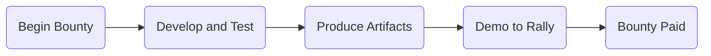

## Welcome to the Rally.io Developer Community

We are happy that you've been accepted as a bounty recipient by Rally.io, and want to ensure that you are successful throughout the process, from development to submission and acceptance of solution.

Part of the process involves producing artifacts including all source code, clear build, test, run, and deploy documentation, and a video that demonstrates functionality for both creators and fans.

Following the successful delivery of  artifacts, you will present live to Rally.io, and answer any questions we may have.

## Bounty Deliverable Artifacts
- Source Code
  - Include all source code used in the solution under src
  - Follow best practices with respect to project organization
- Documentation
  - Update relevant README.md template sections (bracketed items)
    - Include About
    - Include bullet list of functionality
    - Include Rally.io endpoints used
  - Update relevant BUILD.md sections (bracketed items)
    - Include instructions for build
    - Include instructions for test
    - Include instructions for deploy
    - Include instructions for debug
- Instructional Demo Video For Creators
  - Provide a video tailored to the Creators who will be installing, configuring, and using your solution  
  - Walk them through an end to end, from setup and installation, to configuration, to end user (Fan) experience
  - This is a "what is it" and "how to use it" for Creators (Coin Owners)
  - Store the video under /video

## Video Requirements
- Keep to 3-5 minutes
- Use Loom, Quicktime, or similar screencast software
- Keep resolution to at least 720p
- Speak clearly and audibly, and minimize background noise
- Remember to mask username and password where necessary
- Record the Browser Window (not crop, not full screen), unless you have more than to show than browser
  - Even in the cases of Slack and Discord for example, lean towards using a browser tab instead of the fat client to avoid needing to use crop or full screen.
